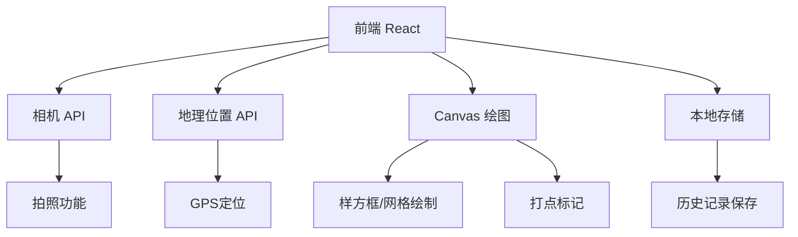
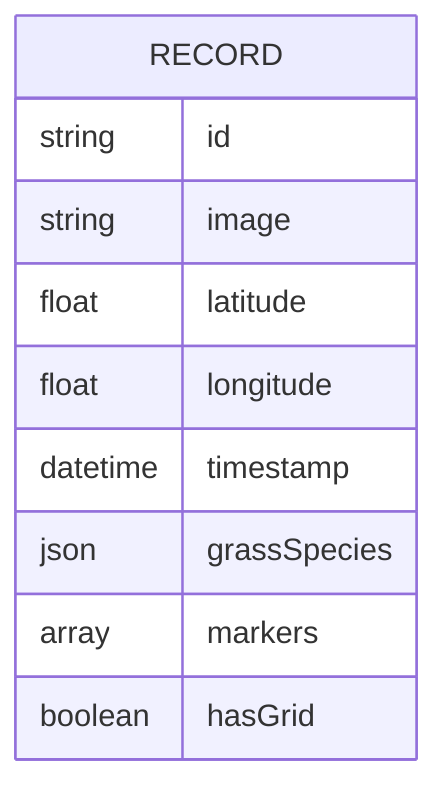

## 1. Architecture Design


## 2. Technology Description
- Frontend: React@18 + TypeScript + tailwindcss@3 + vite
- Initialization Tool: vite-init
- Backend: None（前端应用）
- Database: 浏览器 localStorage
- 其他 API: WebRTC Camera API, Geolocation API, Canvas API

## 3. Route Definitions
| Route | Purpose |
|-------|---------|
| / | 首页/相机页面 |
| /result | 分析结果页面 |
| /history | 历史记录页面 |

## 4. Data Model
### 4.1 Data Model Definition


### 4.2 Data Type Definition
```typescript
interface GrassSpecies {
  name: string;
  coverage: number;
  color: string;
}

interface Marker {
  x: number;
  y: number;
  id: string;
}

interface SurveyRecord {
  id: string;
  image: string;
  latitude: number;
  longitude: number;
  timestamp: Date;
  grassSpecies: GrassSpecies[];
  markers: Marker[];
  hasGrid: boolean;
}
```

