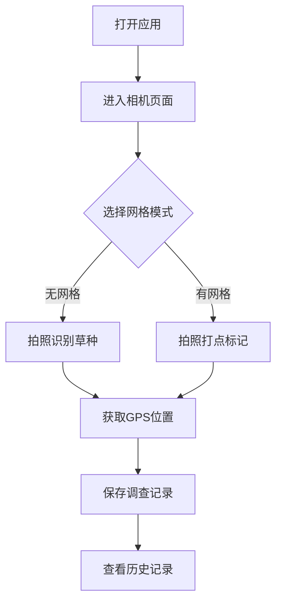

## 1. Product Overview
草地样方调查应用是一款面向生态研究人员和草地管理工作者的专业工具，用于快速、准确地进行草地植被调查。
- 主要功能：拍照自动识别草种、计算盖度、记录样方位置和打点标记
- 目标用户：生态学家、草地研究员、农业技术人员

## 2. Core Features

### 2.1 User Roles
| Role | Registration Method | Core Permissions |
|------|---------------------|------------------|
| 用户 | 无需注册 | 使用所有功能 |

### 2.2 Feature Module
1. **首页/相机页面：相机预览、拍照、样方框显示
2. **分析结果页面：草种识别结果、盖度统计
3. **历史记录页面：历史调查记录管理
4. **设置页面：网格切换、参数配置

### 2.3 Page Details
| Page Name | Module Name | Feature description |
|-----------|-------------|---------------------|
| 首页 | 相机预览 | 实时相机预览、1m×1m无网格框显示 |
| 首页 | 拍照功能 | 拍照捕获图像、切换有/无网格切换 |
| 首页 | 网格切换 | 在无网格框和有网格正方形框之间切换 |
| 首页 | 打点功能 | 在网格框上点击打点记录样点 |
| 首页 | 位置记录 | 获取并记录当前GPS经纬度位置 |
| 分析结果 | 草种识别 | 自动识别图像中的草种种类 |
| 分析结果 | 盖度计算 | 计算每种草种的盖度百分比 |
| 历史记录 | 记录管理 | 查看、删除历史调查记录 |

## 3. Core Process
用户打开应用 → 进入相机页面 → 选择无/有网格 → 拍照 → 自动识别草种并计算盖度 → 记录位置 → 保存结果 → 查看历史记录

## 4. User Interface Design
### 4.1 Design Style
- 主色调：自然绿色系（#2E7D32, #66BB6A）
- 辅助色：暖橙色（#FF9800）
- 按钮风格：圆角按钮，带有阴影效果
- 字体：清晰易读的无衬线字体
- 布局风格：卡片式布局，底部导航栏
- 图标风格：简洁的线性图标

### 4.2 Page Design Overview
| Page Name | Module Name | UI Elements |
|-----------|-------------|-------------|
| 首页 | 相机预览 | 全屏相机预览、半透明样方框、操作按钮 |
| 首页 | 控制栏 | 拍照按钮、网格切换开关、打点按钮 |
| 分析结果 | 结果展示 | 卡片式草种列表、盖度图表、位置信息 |
| 历史记录 | 记录列表 | 时间线式历史记录卡片 |

### 4.3 Responsiveness
移动优先设计，完全适配安卓手机端，针对触摸屏优化

